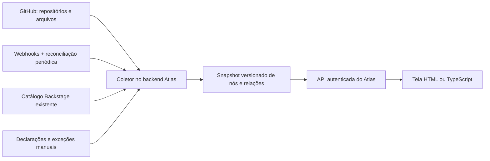

# Alimentação automática do mapa Atlas

Proposta de evolução. O coletor automático e os webhooks descritos aqui ainda não estão implementados. Hoje há discovery de repositórios/tags acionado na interface e dependências declaradas manualmente.

## Fluxo recomendado



O front continua leve e só consulta o snapshot. A coleta acontece mesmo quando nenhum navegador está aberto. Reutilizar a integração GitHub App e o backend/Backstage do Atlas, se já existirem; caso contrário, implementar o coletor como um pequeno serviço ou plugin de backend TypeScript.

## O que alimentar e de onde

| Informação | Fonte | Tratamento |
| --- | --- | --- |
| Repositórios e links | API do GitHub + regras centrais de nomenclatura | Discovery inicial e reconciliação periódica; nomes específicos e exclusões continuam permitidos |
| Relações já catalogadas | API do catálogo Backstage, relações `dependsOn` / `dependencyOf` | Reaproveitar relações existentes e mapear entidades para repositórios; sem supor que toda entidade seja um repo |
| Módulos Terraform | Blocos `module` nos arquivos `.tf` e `.tf.json` | Parser HCL/JSON: interpretar `source`, subdiretório e `?ref=`; registrar consumidor, destino e versão/ref |
| Templates | YAML e arquivos do esqueleto dos templates Backstage | Adaptadores para as actions efetivamente usadas no Atlas; aceitar apenas referências resolvidas, com origem conhecida |
| Plugins/frontend/backend | `package.json`, lockfiles e metadados de origem dos pacotes, quando aplicável | Relacionar pacote ao repositório usando um índice explícito; não deduzir somente pelo nome npm |
| Versão disponível | Tags estáveis SemVer do repositório | Manter a política atual de maior versão estável; releases podem ser outra política configurável |
| Relações que não aparecem no código | Manifesto no repo, por exemplo `.atlas/dependencies.json` | Declaração versionada com dono definido e possibilidade de revisão por PR |

O arquivo `.terraform.lock.hcl` registra dependências de providers; não é a fonte para versões de módulos remotos. Nos módulos Git, `ref` pode ser tag, branch ou commit. Uma branch ou expressão dinâmica não deve virar uma versão SemVer artificial.

`dependsOn` no catálogo Backstage representa uma relação, mas não fornece, por si só, a versão do código consumida. Essa informação precisa vir do arquivo de origem ou de uma declaração explícita.

## Manifesto incremental

Manter a configuração central para discovery e permitir uma declaração pequena em cada consumidor enquanto os extratores são desenvolvidos. Exemplo proposto de `.atlas/dependencies.json` em `atlas-template-rds`:

```json
{
  "schemaVersion": 1,
  "dependencies": [
    {
      "repository": "atlas-terraform-rds",
      "ref": "v2.3.0",
      "sourceFile": "skeleton/main.tf"
    },
    {
      "repository": "atlas-terraform-cloudwatch",
      "ref": "v1.4.0",
      "sourceFile": "skeleton/main.tf"
    }
  ]
}
```

Este é um contrato proposto para o futuro coletor, diferente do JSON central hoje importado pela tela. Sua versão deve ser obtida do código sempre que possível. Evitar manter manualmente a mesma versão no manifesto e no Terraform: o manifesto deve cobrir lacunas, e divergências entre fontes devem gerar aviso.

Uma relação normalizada deve preservar `from`, `to`, `declaredRef`, `resolvedCommit` (quando resolvido), `sourceKind`, `sourceFile`, `sourceCommit`, `observedAt`, `resolutionStatus` e eventuais substituições manuais. Guardar evidência permite abrir exatamente o arquivo/commit que explica a conexão.

## Como manter atualizado

1. Fazer uma varredura inicial dos repositórios acessíveis à instalação GitHub App.
2. Em `push`, reler os arquivos relevantes do consumidor; em eventos de tags/releases, recalcular a versão disponível do destino e os indicadores de seus consumidores.
3. Em eventos de repositório e mudanças nos repositórios acessíveis à instalação, atualizar o inventário.
4. Reconciliar periodicamente (por exemplo, a cada hora, a ajustar ao volume) para recuperar eventos perdidos e remover referências que deixaram de existir.
5. Publicar um snapshot consistente para a interface, com data e estado da coleta por repositório.

No webhook: validar assinatura, deduplicar pelo identificador de entrega, colocar o trabalho em fila e responder rapidamente. Processar somente os repositórios/commits necessários, com cache por SHA, limites de concorrência e retry com backoff. Uma falha de permissão não comprova que um repositório foi excluído; preservar o último dado com estado desatualizado/inacessível.

## Etapas de implementação

**Primeira entrega:** coletor TypeScript agendado no backend Atlas, regras centrais, leitura de manifestos por repo e tags; snapshot persistente e endpoint de leitura para o front. É possível começar com um job GitHub Actions, mas o JSON de repositórios privados deve continuar em armazenamento/API autenticados, não em publicação pública.

**Segunda entrega:** extratores Terraform e templates, reaproveitamento do catálogo Backstage e precedência explícita entre fontes. Substituições manuais devem ser identificadas e não apagadas pela coleta.

**Terceira entrega:** webhooks incrementais, histórico de alterações e impacto transitivo. Se B usa A e A muda, distinguir atualização disponível de incompatibilidade comprovada.

Para módulos com ranges, registrar tanto a restrição declarada quanto a versão resolvida quando houver evidência. Para saber o que está realmente implantado em um ambiente, será necessária uma fonte adicional de deployment/state; uma referência no template só informa o que ele declara consumir.

## Antes de integrar à empresa

É necessário conhecer a organização/Enterprise, a integração de GitHub App já disponível, a estrutura real de pelo menos um template e um módulo, e a API existente do Atlas/Backstage. Isso define os extratores, permissões de leitura e o local de execução. Não é necessário mudar o front para um framework para essa evolução.

## Referências oficiais

- [GitHub: eventos de webhook](https://docs.github.com/en/webhooks/webhook-events-and-payloads)
- [GitHub: práticas para webhooks](https://docs.github.com/en/webhooks/using-webhooks/best-practices-for-using-webhooks)
- [Backstage: API do catálogo](https://backstage.io/docs/features/software-catalog/software-catalog-api/)
- [Terraform: fontes e versões de módulos](https://developer.hashicorp.com/terraform/language/modules/configuration)
- [Terraform: arquivo de lock de dependências](https://developer.hashicorp.com/terraform/language/files/dependency-lock)
